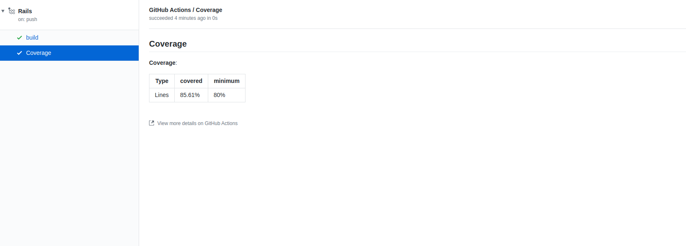

## Coverage check

A GitHub Action that check minimum coverage percentage!

This action requires a Github token with `checks:write` scope to allow create the check run using the Github API v3.
But no need to generate any new token, you can use the Github action token (`${{ github.token }}`)

### Usage

#### Lcov

```yml
- uses: devmasx/coverage-check-action@v1.2.0
  with:
    type: lcov
    result_path: coverage/example.lcov
    min_coverage: 90
    token: ${{ github.token }}
```

#### [Simplecov](https://github.com/colszowka/simplecov)

```yml
- uses: devmasx/coverage-check-action@v1.2.0
  with:
    type: simplecov
    result_path: coverage/.last_run.json
    min_coverage: 90
    token: ${{ github.token }}
```

## Screenshots



